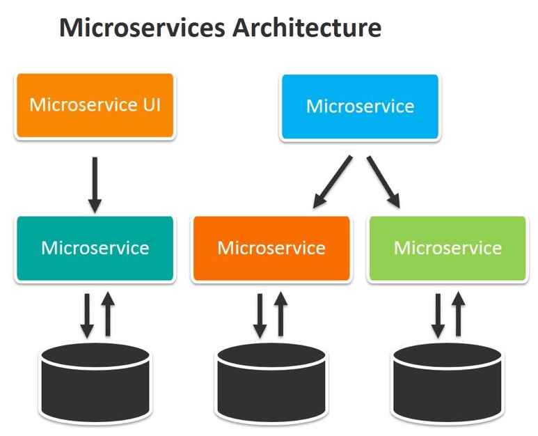

= Lab 2 - Microservices Architecture

== 1. Decomposing the Monolith

To transition from the monolithic application, we segment functionalities into **four distinct Flask applications**, each representing a separate service domain. This allows for independent development, deployment, and scaling.

Each service operates independently and listens on its own dedicated port, meaning the failure of one service will not necessarily take down the others.

=== The Microservices Breakdown

[%header,cols="2,3,^1,1",align="center",stripe="even",width="100%"]
|===
^| Service              ^| Responsibility                                                   ^| Port     ^| File
| Inventory Management  | Handles all operations related to inventory stock and pricing.    | `5001`    | `inventory_service.py`
| Order Processing      | Oversees order placement and tracking.                            | `5002`    | `order_service.py`
| Customer Management   | Dedicated to handling customer information and details.           | `5003`    | `customer_service.py`
| Billing Service       | Responsible for managing billing and payment processes.           | `5004`    | `billing_service.py`
|===

== 2. Starting the Services Independently

Unlike the monolith, where one command started everything, running the microservices requires starting four separate processes.

WARNING: Ensure you have terminated the monolithic application from Lab 1 (`CTRL+C`) before proceeding.

=== Verify Service Ports

Use `grep` to confirm that each file is configured to run on its designated port:

[source,shell]
----
$ grep app.run *.py
inventory_service.py:     app.run(port=5001)
order_service.py:         app.run(port=5002)
customer_service.py:      app.run(port=5003)
billing_service.py:       app.run(port=5004)
----

=== Launch All Services

To run all four services concurrently, you will need to open **four separate terminal windows** (Terminal A, B, C, D).

[source,shell]
----
# TERMINAL A:
$ python3 inventory_service.py

# TERMINAL B:
$ python3 order_service.py

# TERMINAL C:
$ python3 customer_service.py

# TERMINAL D:
$ python3 billing_service.py
----

All four terminals should now display Flask debugger output indicating the service is running on its respective port.

== 3. Testing the Application Boundaries

We confirm that each service is completely independent and only responds to requests intended for its specific domain.

[source,shell]
----
# TEST 1: Requesting Inventory data on the correct port (5001)
$ curl http://127.0.0.1:5001/view_inventory
{"inventory":{...}} 
# Output: Success. Inventory data is returned.

# TEST 2: Requesting Inventory data on the Order Service port (5002) (incorrect)
$ curl http://127.0.0.1:5002/view_inventory
<!doctype html>
<html lang=en>
<title>404 Not Found</title>
# Output: Failure (404 Not Found). The Order Service does not host the Inventory endpoint.
----

This confirms that the *deployment unit* is now tied to the *functional domain*, not the entire application.

=== Cross-Service Validation (Customer Management)

We can access the Customer Management Service directly on port `5003`.

[source,shell]
----
$ curl http://127.0.0.1:5003/view_customer/customer_id_1
{
  "customer_details": {
    "address": "123 Main St",
    "name": "John Doe"
  }
}

$ curl http://127.0.0.1:5002/view_orders

{
  "orders": []
}
----

=== Placing an Order via API Call

Order placement is managed by the Order Processing Service on port `5002`. This service is responsible for adding the transaction data.

[source,shell]
----
# Place a new order using POST method, targeting port 5002
$ curl -X POST \
    -H "Content-Type: application/json" \
    -d '{"customer_id": "customer_id_1", "medicine": "medicine_A", "quantity": 5}' \
    http://localhost:5002/place_order

{
  "message": "Order placed successfully",
  "order_details": { ... }
}
----

=== Final Order Verification

Verify the order exists by querying the Order Processing Service on port `5002` again:

[source,shell]
----
$ curl http://127.0.0.1:5002/view_orders

{
  "orders": [
    {
      # ... the new order details are returned ...
    }
  ]
}
----

== 4. Conclusion: Independent Scaling and Resilience

In this microservices model, if the **Inventory Management Service (5001)** fails, the **Order Processing Service (5002)** and the **Customer Management Service (5003)** would remain running, allowing partial functionality to continue.

This architecture naturally leads to containerization, as it provides a clean way to package each isolated service with its specific dependencies and manage its lifecycle independently. 
