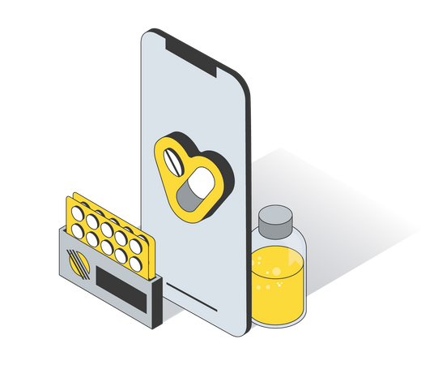
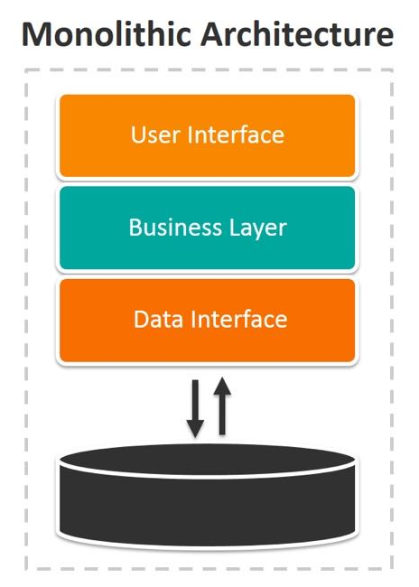

= Lab-01 - Monolithic
:tip-caption: 💡 TIP
:warning-caption: ⚠️ WARNING

== 1. Architectural Overview: Monolith

Imagine a real-world scenario where we model a monolithic architecture for a pharmaceutical company's application. In this emulation, *all* application code, business logic, and services run together on a single server. This tightly coupled design is known as a **Monolith**.

For the sake of clarity, we will avoid delving into the intricacies of the actual Python code and instead focus on understanding the application's single operational unit.

== 2. Setting Up the Working Environment

We will first run the application directly on the host machine to understand the dependency challenges inherent in monolithic architecture.

NOTE: The `monolithic` directory hosts our application files for this lab.

=== Application Pre-requisites (Host Installation)

Given that our pharmacy application is developed in `Python` using the `FLASK` framework, we must manually install all dependencies directly onto our host system.

[source,shell]
----
# 1. Install Python 3 and the PIP package manager
$ sudo dnf install -y python3
$ sudo dnf install -y pip

# 2. Ensure pip is up-to-date
$ pip install --upgrade pip

# 3. Install the required Python frameworks/libraries
$ pip install Flask
$ pip install requests
----

== 3. Executing the Application

In this monolithic framework, all functionalities (orders, inventory, customer lookup) are consolidated and encapsulated within a single Python script.

NOTE: The Flask debugger will utilize the current terminal session, meaning you will need a second terminal to run the test commands.

Run the application with the following command from the `monolithic` directory:

[source,shell]
----
$ cd monolithic
$ python3 pharmacy.py
 * Running on http://127.0.0.1:5000 (Press CTRL+C to quit)
----

While the application runs, notice that the Flask debugger currently occupies your terminal. Consequently, **open a new terminal window** (Terminal B) to test the application through direct API calls.

== 4. Testing the Monolithic API

The Flask web application is now operational and accessible via the loopback address (`127.0.0.1`) on port `5000`. We will use `CURL` to verify the application endpoints.

TIP: All API calls are directed to the *same* application on the *same* port, reflecting the monolithic structure.

=== Initial Connectivity Check

Initiate the testing phase with a straightforward direct call to verify connectivity and version:

[source,shell]
----
# Run this command in Terminal B
$ curl http://127.0.0.1:5000
Pharmacy v1
----

We confirm the application is responsive.

=== Retrieve Inventory and Customer Data

Now, verify the inventory, orders, and customer details, noting that all data lives within this single application instance:

[source,shell]
----
# Verify the hardcoded inventory data
$ curl http://127.0.0.1:5000/view_inventory

# Retrieve John Doe's customer details
$ curl http://127.0.0.1:5000/view_customer/customer_id_1
----

=== Place a New Order (POST Request)

Since order placement modifies data, it requires the HTTP POST method and the correct JSON `Content-Type` header.

[source,shell]
----
# 1. Check existing orders (should be empty array: [])
$ curl http://127.0.0.1:5000/view_orders

# 2. Place a new order using POST method
$ curl -X POST \
    -H "Content-Type: application/json" \
    -d '{"customer_id": "customer_id_1", "medicine": "medicine_A", "quantity": 5}' \
    http://localhost:5000/place_order
----

=== Verify the Order Status

Finally, confirm that the order was successfully added and persisted within the single running application:

[source,shell]
----
$ curl http://127.0.0.1:5000/view_orders
{
  "orders": [
    {
      # ... output includes the new order details ...
    }
  ]
}
----

== 5. Architectural Discussion: The Limits of Monoliths

In this simple example, all components—order processing, inventory, and customer lookup—are managed by a single Python process.

If the *Inventory* code section had a crash or a memory leak, the entire application, including *Order Processing* and the *Customer API*, would fail, requiring a complete server restart. This is the central weakness we aim to solve with distributed (microservices) architecture.

image::mono-servers.png[600,600,align=center]

== 6. Terminating the Application

WARNING: Before continuing to the next lab, you **must** terminate the monolithic application running on port `5000`.

Use the (`CTRL+C`) key combination in the first opened terminal (Terminal A) where the Flask application is currently attached.
