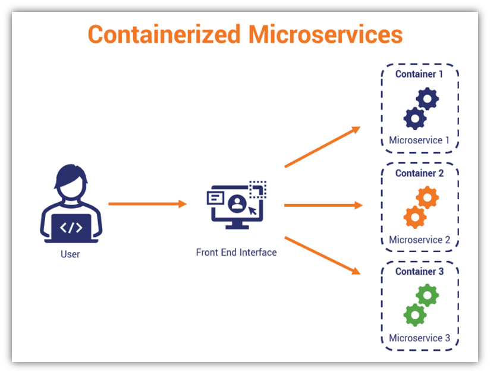

= Lab03 - Managing Containers with Commands
:tip-caption: 💡 TIP
:warning-caption: ⚠️ WARNING

We have executed our demo application as a monolith and as microservices, but we haven't used containers to host it; instead, we have used regular services running on a server like any other application.

Running microservices manually inside a container (without pre-built images or dedicated `Containerfiles`—concepts we will explore later) is complex but demonstrates the **manual dependency hell** that containerization solves.

Each container will be treated as a new, minimal Linux server. All dependencies must be resolved, and network connectivity must be explicitly managed.

IMPORTANT: Be sure all previously executed services from Lab 2 are stopped by closing the four terminals where the services were running.

=== Create and Run Containers

Open a terminal and execute the following commands to create the four service containers:

[source,shell]
----
$ podman run --name inventory_service --network host -dti fedora /bin/bash
$ podman run --name order_service --network host -dti fedora /bin/bash
$ podman run --name customer_service --network host -dti fedora /bin/bash
$ podman run --name billing_service --network host -dti fedora /bin/bash
----

[NOTE]
====
. The (`-dti`) flags create the container *detached* (`-d`), with a *terminal* (`-t`), and in *interactive* mode (`-i`) so we can connect to them later.
. We passed the command (`/bin/bash`), which keeps the container alive and ready for interactive commands.
====

[IMPORTANT]
====
A Note on Container Networking: We use the *Host Network Mode* (`--network host`) in these commands. This flag disables network isolation, meaning a service running on port 5001 inside a container is identical to a service running on port 5001 on the host itself. This simplifies cross-container communication for this lab.
====

== Verify Running Containers

Execute `podman ps` to confirm all four containers are running the `/bin/bash` shell:

[source,shell]
----
$ podman ps
CONTAINER ID  IMAGE      COMMAND    CREATED      STATUS   NAMES
# ... list of four running containers ...
----

== 2. Installing Dependencies and Copying Code

These containers are just empty new servers. We must install the application prerequisites (`Python3`, `pip`, `Flask`) and copy the code into each one.

=== Install Dependencies

We use the **`podman exec`** command to run the installation commands *inside* the running container instance.

[source,shell]
----
# Install Python and pip on all four containers sequentially
$ podman exec -ti inventory_service dnf install -y python3 pip
$ podman exec -ti order_service dnf install -y python3 pip
$ podman exec -ti customer_service dnf install -y python3 pip
$ podman exec -ti billing_service dnf install -y python3 pip
----

Update pip on every container but this time let's use a loop to avoid repetition:

[source,shell]
----
for service in inventory_service order_service customer_service billing_service
do
  podman exec -ti $service pip install --upgrade pip
done
----

Now, install `Flask` and `requests` libraries on every container, but this time let's use a list in file to avoid repetition. Create a file named `pharmacy.svc` with the following content:

[source,ini]
----
inventory_service
order_service
customer_service
billing_service
----

Then run the following command to read the file line by line and install the required libraries in each container:

[source,shell]
----
for service in $(cat pharmacy.svc)
do
  podman exec -ti $service pip install Flask requests
done
----

> All three different approaches (individual commands, loop, and file list) achieve the same result.

=== Copy Application Code

We use **`podman cp`** to copy the service code from our local host directory into the container's root directory (`/`).

NOTE: Be sure you are in the directory where the `*_service.py` files are located before executing these commands.

[source,shell]
----
$ podman cp inventory_service.py inventory_service:/
$ podman cp order_service.py order_service:/
$ podman cp customer_service.py customer_service:/
$ podman cp billing_service.py billing_service:/
----

To verify that our files were successfully copied let's use the list in the pharmacy.svc file again:

[source,shell]
----
for service in $(cat pharmacy.svc)
do
  echo "Verifying file in container $service:"
  podman exec -ti $service ls -l ${service}.py
done
----

== 3. Executing Services in Containers

We will now execute the main Python application within each container using `podman exec`. We use the `-d` (detached) flag so the process runs in the background of the container, allowing the terminal to remain free.

[source,shell]
----
$ podman exec -d inventory_service python3 inventory_service.py
$ podman exec -d order_service python3 order_service.py
$ podman exec -d customer_service python3 customer_service.py
$ podman exec -d billing_service python3 billing_service.py
----

=== Verification: Running Processes

We can verify the Python processes are now running inside the containers using `podman top`.

[source,shell]
----
$ podman top inventory_service
# ... you should see the python3 process ...

# You can also see the processes running directly from the host, 
# because containers are ultimately just processes running on the host kernel.
$ ps -ef | grep service.py
----

== 4. Testing the Containerized Application

Because we used the `--network host` flag, the microservices are accessible directly from the host's loopback address, just as they were when running directly on the host in Lab 2.

=== Cross-Service Communication Test

We will test the complex workflow of placing an order, which requires the Order Service (5002) to communicate with the Inventory Service (5001).

[source,shell]
----
# 1. Place a new order using POST method, targeting port 5002
$ curl -X POST \
    -H "Content-Type: application/json" \
    -d '{"customer_id": "customer_id_1", "medicine": "medicine_A", "quantity": 5}' \
    http://localhost:5002/place_order

# 2. Verify the order exists by querying the Order Processing Service (5002)
$ curl http://127.0.0.1:5002/view_orders

{
  "orders": [
    {
      # ... the new order details are returned ...
    }
  ]
}
----

The successful execution confirms that the manually configured containers are running correctly and can communicate over the shared host network.

== 5. Terminating the Lab

[source,shell]
----
# Stop all running containers by name
$ podman stop inventory_service order_service customer_service billing_service

# All the containers should now be in 'Exited' status
$ podman ps -a
----

Now that our services are running independently in containers, they can fully leverage the advantages of containerized applications. We've initiated them manually, but in the next lab, we will adopt a more automated and efficient approach using custom images and orchestration.
