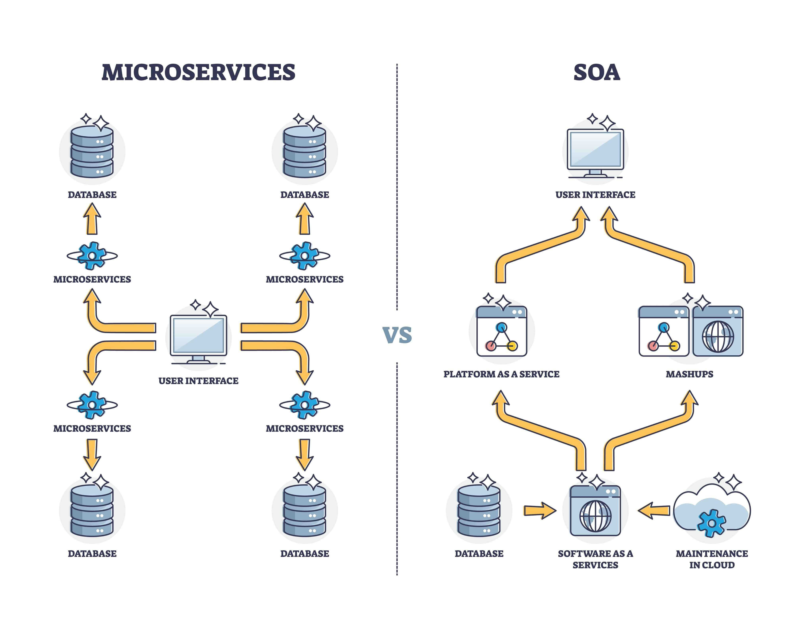

= Lab 9 - Isolate the Application (Bridge Networking)
:tip-caption: 💡 TIP
:warning-caption: ⚠️ WARNING

Until now, we have been using the Host Network Mode (`--network host`). This method is simple but **removes all network isolation**, making the containers highly insecure.

The goal of this lab is to create a dedicated network for our application, allowing the containers to work in isolation from the host but still communicate with each other internally.

[NOTE]
====
Before starting this lab, run `./tools/assign-lab-ports.sh` from the root of this repository.

Use the `lab-ports` command at anytime to see your ports.
====

== 1. Creating the Isolated Bridge Network

We will create a custom bridge network named `pharmacy`. Podman will automatically manage IP addressing (DHCP) within this new, isolated subnet.

[source,shell]
----
$ podman network create pharmacy
$ podman network inspect pharmacy
----

NOTE: The `inspect` command shows the new subnet (e.g., 10.88.0.0/16) and the bridge name created on your host system.

== 2. Preparing the Application for Isolation

When using an isolated network, the application inside the container must listen correctly to receive forwarded traffic from the host.

=== Why Change the Code to `host='0.0.0.0'`? 🏆

By default, Flask binds to `127.0.0.1` (localhost), meaning it only accepts connections originating from *inside its own network namespace*.

Binding to **`0.0.0.0` (All Interfaces)** tells the application to accept connections on the virtual network interface assigned by Podman. When we use port mapping (`-p 5001:5001`), Podman forwards traffic from the host into the container, and the application must be listening on `0.0.0.0` to accept it.

The engineering team already modified the code of the application to accomplish this. You can verify the changes by searching for `app.run` in the source files:

[source,python]
----
$ grep app.run *.py
$ lab-ports
----

Also the URL endpoint for inter-service communication has been updated to use the container names instead of localhost IP address. For example, in `order_service.py`:

[source,python]
----
INVENTORY_API_URL = "http://inventory_service:{ORDER_PORT}"
----

=== Rebuild the Final Image

Since we modified the source code, we must rebuild the image to include the `0.0.0.0` binding fix.

[source,shell]
----
$ podman build -t pharmacy:v5 .
----

== 3. Deploying to the Isolated Network

We now deploy the containers using two critical flags:
1.  `--network pharmacy`: Connects the container to our new, isolated subnet.
2.  `-p HOST_PORT:CONTAINER_PORT`: Exposes the service to the host machine for external access.

[source,shell]
----
$ podman rm -f inventory_service customer_service billing_service order_service
$ podman run --name inventory_service --network pharmacy --env-file ~/.containers-labs.env -p ${INVENTORY_PORT}:5001 -d localhost/pharmacy:v5 inventory_service.py
$ podman run --name customer_service --network pharmacy --env-file ~/.containers-labs.env -p ${CUSTOMER_PORT}:5003  -d localhost/pharmacy:v5 customer_service.py
$ podman run --name billing_service --network pharmacy --env-file ~/.containers-labs.env -p ${BILLING_PORT}:5004  -d localhost/pharmacy:v5 billing_service.py
$ podman run --name order_service --network pharmacy --env-file ~/.containers-labs.env -v pharmacy_orders_data:/data:rw -p ${ORDER_PORT}:5002  -d localhost/pharmacy:v5 order_service.py
----

Verify that all containers are running:

[source,shell]
----
$ podman ps
----

== 4. Testing the Isolated Application

We now test that both external access (Host --> Container via port map) and internal communication (Container --> Container via network bridge) are working.

=== Test External Host Access

We verify that the host can reach the Inventory Service via the mapped port:

[source,shell]
----
$ curl http://127.0.0.1:${INVENTORY_PORT}/view_inventory

{"inventory":{"medicine_A":{"price":10,"stock":100},...}}
----

=== Test Inter-Service Communication

Place an order. This requires the Order Service (running on its *internal* network address) to call the Inventory Service (also on its *internal* network address), and finally expose the result back to the host via the mapped port.

[source,shell]
----
# Place a test order via port 5002
$ curl -X POST \
    -H "Content-Type: application/json" \
    -d '{"customer_id": "customer_id_1", "medicine": "medicine_A", "quantity": 5}' \
    http://127.0.0.1:${ORDER_PORT}/place_order

# Verify the order exists
$ curl http://127.0.0.1:${ORDER_PORT}/view_orders
----

We have achieved a fully isolated and persistent application that runs on its own secure network, using port mapping to expose only the necessary services to the host.

== 5. Terminating the Lab

[source,shell]
----
$ podman stop -a
----
